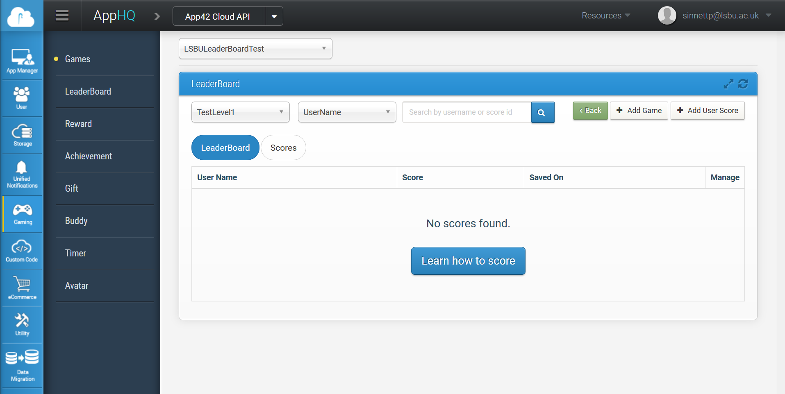
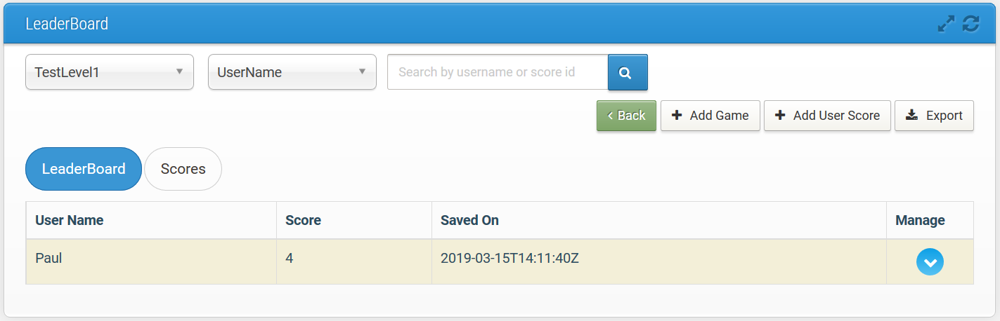
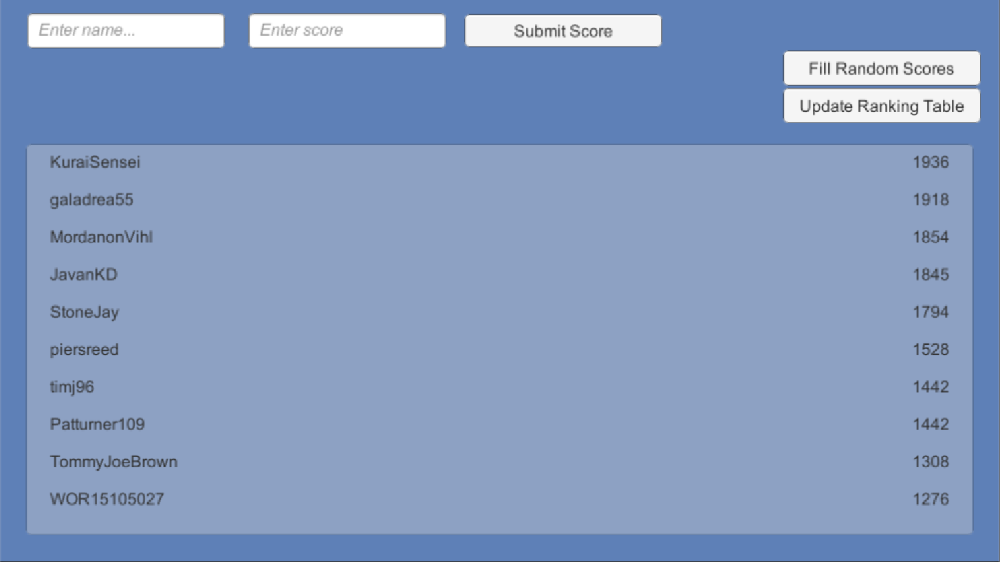

# Leader board test using App42

This tutorial demonstrates how to set up an online leader board for your game using the App42 service. The service starts free for up to 5 leader boards processing 1,000,000 calls per month which should be enough for testing to get you started. If you need additional boards or bandwidth, there are tiered prices as detailed [here](http://api.shephertz.com/pricing.php).

## Registering your account

To register for an App42 account go to the following web address: <https://apphq.shephertz.com/register>

You can log in with Facebook, GitHub, Google, or register using your email.

## Creating an App for your game on your account

Once you have an account, you can then create an App by going to the service page and clicking on the `Create App` button. Your `App Name` needs to be unique throughout the App42 service so you'll probably need to create a name that embeds something unique to your game. I've used `LSBULeaderBoardTest` for my example.

## Creating a leader board for your game (App)

Now on the App42 service page, click on the Gaming tab, and then on the LeaderBoard button. You can then add your first leader board by clicking the `Add Game` button. You must choose a game name for this, in this case the game name should uniquely identify the leader board within your game App. I've used `TestLevel1` as the name of my first board.



## Installing the App42 SDK

First you need to download the App42 SDK dll from here:

<https://github.com/shephertz/App42_Unity3D_SDK/raw/master/4.2/App42-Unity3D-SDK/App42-Unity3D-SDK-4.2.dll>

Make a folder called `Plugins` inside your project's `Assets` folder and put the `dll` file in there.

## Initialising the App42 service

Create a new script called `LeaderBoard.cs` and attach in to an object in your scene. I'm going to build a 2D canvas to display my leader board and test controls, so I started by creating a `UI\Canvas` object and attaching my `LeaderBoard` script to that.

Somewhere in your code you will need to initialise the App42 system. As this is just a test of the leader board functionality, I've done this in the `Start` function of my `LeaderBoard` script. However, if you want to use more of the functionality you should break out a separate global object to handle the initialisation code, because you only want initialisation to happen once globally for your project.

```.cs
void Start()
    {
        string apiKey = "77380b4ffde67a4df3ca6823eb6c02fa6a2fc2917378a565bdb9e267a2457100";
        string secretKey = "d863121bdcaa08bfca3d41dc3c4d41f26f7489c09efb1992a9bd6695eecc4223";

        App42API.Initialize(apiKey, secretKey);
        App42API.SetOfflineStorage(true);
    }
```

You can find your API key and secret key values on your App42 account for your chosen App. The values above are examples only and don't link to a valid app. If you try to run this code without inserting your own key and secret key values, you will get a `Security Exception`.

The call to `SetOfflineStorage` here enables a local cache feature. If, for some reason, you are not able to connect to the server at the point your score was submitted, then it will be cached and uploaded at the next available opportunity.

## Submitting a score

To submit a score, you will first need to create an instance of the `ScoreBoardService` class. The SDK provides a function to create one called `BuildScoreBoardService`. This object can be reused so it makes sense to create it as an instance variable on start after initialising the API:

```.cs
    ScoreBoardService scoreBoardService;

    void Start()
    {
        …
        App42API.Initialize(apiKey, secretKey);
        …
        scoreBoardService = App42API.BuildScoreBoardService();
    }
```

To save a user score you can then use the function `SaveUserScore` on the `scoreBoardService` object. You will need to provide:

- the leader board name (this is the name you chose above)
- a user name for the score (must be unique within your player base)
- a score
- a callback for success or failure

The callback must be an instance of a class implementing the `App42Callback` interface. This interface requires you to provide two functions: `OnSuccess` and `OnException`. An easy way to do this is to add the `App42Callback` interface to a behaviour. I'm going to add it to my `LeaderBoard` behaviour. I also need to implement the functions which I'm going to do by logging out there input.

```.cs
    public class LeaderBoard : MonoBehaviour, App42CallBack
    {
        …
        public void OnException(Exception exception)
        {
            Debug.LogWarningFormat("SaveScore exception: {0}", exception);
        }

        public void OnSuccess(object response)
        {
            if (response is App42OfflineResponse)
            {
                Debug.LogFormat("Network not available, score stored in cache");
            }
            else if (response is Game)
            {
                Debug.LogFormat("Score saved to online leader board");
            }
        }
    }

```

Now you can upload a score like this:

```.cs
scoreBoardService.SaveUserScore("TestLevel1", "Paul", 4, new SaveScoreCallback());
```

If your score uploads it should look something like this on your App42 account:



## Getting the high score rankings

There are several alternatives for getting the rankings table. I'm going to demonstrating getting the top 10. To do this you must call the function `GetTopNRankings` on the `scoreBoardService`. You must provide:

- the leader board name
- the maximum rankings to load
- a callback for success or failure

Since in this case we want to capture the results from the server, I'm going to attach the callback to a new behaviour called `Rankings`. This example logs, up to the top 10 entries on the console.

```.cs
public class Rankings : MonoBehaviour, App42CallBack
{
    public void OnSuccess(object response)
    {
        if (response is Game)
        {
            foreach (Game.Score score in game.GetScoreList())
            {
                Debug.LogFormat("{0} : {1}", score.userName, score.value);
            }
        }
    }

    public void OnException(Exception exception)
    {
        Debug.LogWarningFormat("GetTopNRankings exception: {0}", exception);
    }
}
```

To trigger a load of the top 10 you can make the following call from this behaviour by using a `scoreBoardService` object instance as above:

```.cs
scoreBoardService.GetTopNRankings("TestLevel1", 10, this);
```

## Example scene

I have included the scene `LeaderBoard` which allows you to test some of the App42 online leader board features. Before you run this test scene make sure you have created your own App and game board as described above. Change the `apiKey` and `secretKey` values in the `Start` function of `LeaderBoard.cs` to match those that you created on the App42 web site.

Now you can run the sample. Enter a name is the first and a score in the second, and then press the `Submit Score` button. You should see the message `Score saved to online leader board` appear in your console. And in your browser, your LeaderBoard should now contain an entry. (You may need to push the refresh button for it to update.)

To see your entry on screen in the example scene, press the `Update Ranking Table` button. Your view should then mirror the result on the web site.

To enter a large number of random scores quickly, press the `Fill Random Scores` button. This will send a random selection of scores with your GitHub user names. Again, you will need to press the `Update Ranking Table` button to see the results.


